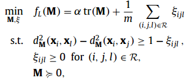
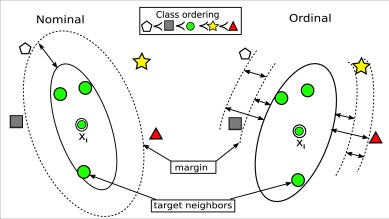

# ODML
Distance metric learning for ordinal classification based on triplet constraints

**How to learn a linear transformation A ?**

 

### Prerequisites
This has been tested using MATLAB 2010A and later on Windows and Linux (Mac should be fine).

## Installation
Download the folder "ODML" into the directory of your choice. Then within MATLAB go to file >> Set path... and add the directory containing "ODML" to the list (if it isn't already). That's it.

## Usage
```matlab
>> demo
```
## Authors

* [Bac Nguyen Cong](https://github.com/bacnguyencong)

## Acknowledgments
If you find this code useful in your research, please consider citing:
``` bibtex
@Article{Nguyen2018a,
  Title       = {Distance metric learning for ordinal classification based on triplet constraints},
  Author      = {Bac Nguyen and Carlos Morell and De Baets, Bernard},
  Journal     = {Knowledge-Based Systems},
  Year        = {2018},
  Pages       = {17-28},
  Volume      = {142}
}
```

